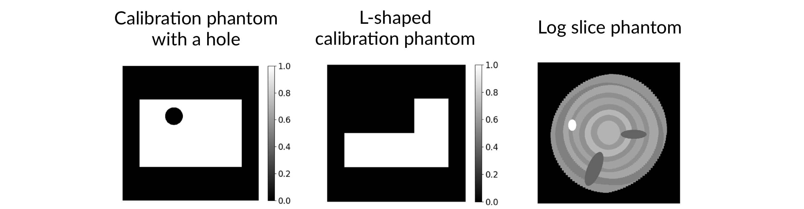

# Geometry Parameter Estimation for Sparse X-ray Log Imaging
## General information
The repository contains scripts for geometry parameter estimation 
and reconstruction in fan-beam X-ray tomography in aplication to sawmill log imaging:
* `geom_param_search.py` - script for obtaining optimal geometry parameters, 
where we calculate the maximum cross-correlation between a known-sized calibration object image 
and its filtered backprojection reconstruction, 
and use differential evolution as an optimiser;
* `param_search_runner.sh` - wraper script for running `geom_param_search.py` jobs in parallel 
to get different parametrisations (different sets of parameters);
* `plot_recos_with_params.py` - script to obtain filtered backprojection reconstructions with different parametrisations
and plot them in one figure for comparison;
* `get_reconstructions.py` -  script to obtain reconstructions with given parametrisation by three different methods 
(filtered backprojection, Tikhonov regularisation and Bayesian inversion with edge-preserving Cauchy priors) 
for various number of projection angles;
* `theorymatrix.jl` - Julia script used in `get_reconstructions.py` to implement Bayesian inversion with edge-preserving Cauchy priors;
* `param_sample_intersections.jl` - Julia script that estimates the geometry parameters by using only a set of given R^2 points and their projections at a virtual infinite long detector plate at different rotation angles of virtual X-ray device. 

For illustration purpose, we provide synthetic data: 

* two callibration phantoms used for geometry parameter estimation:
  - calibration phantom with a hole (```./hole_disk/```);
  - L-shaped calibration phantom (```./L_disk/```);
* synthetic X-ray data of a cross-sectional phantom of a log used for testing (```phantom_sino.mat```). 

## Installation
The scripts use the Conda environment and the Operator Discretization Library (ODL).
You can use the installation guide from the ODL documentation:
https://odlgroup.github.io/odl/getting_started/installing_source.html

Alternatively, you can run the following command 

```shell
conda create --name odl-py3.6 --file freezed-requirements.txt
```

The command should create the Conda environment  with name `odl-py3.6` and install all the required  dependencies.

To activate the Conda environment, you should run 

```shell
conda activate odl-py3.6
```

## Geometry parameter estimation with calibration phantoms 

### Run one parameter search program 

To estimate geometry parameters, you should run 

```shell
python3 geom_param_search.py -d "./<calibration_phantom_name>/"
```

where you should specify the folder with calibration phantom data 
after the option `-d`. 
In the current repository, two options are available. 
For example, to perform parameter search based on L-shaped calibration disk,
you should run  

```shell
python3 geom_param_search.py -d "./L_disk/"
```

Alternatively, to use the calibration phantom with a hole, you should run

```shell 
python3 geom_param_search.py -d "./hole_disk/"
```


The result parameter vector will be saved as a numpy file to directory `./<calibration_phantom_name>/params/`.

### Run several parameter search programs simultaneously 

There is a simple Bash-script in the repository 
which you can use to run `N` programs `geom_param_search.py` simultaneously.
For example, to execute 6 programs on geometry parameter search 
using the calibration phantom <calibration_phantom_name>, you should run

```bash
bash param_search_runner.sh 6 "./<calibration_phantom_name>/"
```

The output parameters will be saved to directory `./<calibration_phantom_name>/params/`.

### Plot reconstructions with different parametrisation
After running at least 6 programs (see [section](#run-several-parameter-search-programs-simultaneously)) 
and getting 6 different parametrisations, 
you can get the filtered backprojections with those  parametrisations 
and plot them in one figure to compare by running

```shell
python3 plot_recos_with_params.py -d "./<calibration_phantom_name>/"
```

## Reconstructions from sparse X-ray data 

To obtain reconstructions using three different methods 
(filtered backprojection, Tikhonov regularisation, 
and Bayesian inversion with edge-preserving Cauchy priors) 
for various number of projection angles (360, 180, 90, 45, 20), 
you should run 

```shell
python3 get_reconstructions.py
```

Since the script `get_reconstructions.py` invokes the Julia script `theorymatrix.jl`,
you should get Julia (and required packages) installed first.

After installing Julia, you can install the required packages 
```
"ArgParse"
"MAT" 
"Optim"
"ProgressBars"
"RegionTrees" 
"StaticArrays"
"VectorizedRoutines" 
```
by running 

```shell
julia
using Pkg
Pkg.install("<package_name>")
```

When all the packages are installed, one can run ```exit()``` to quit the virtual session.

