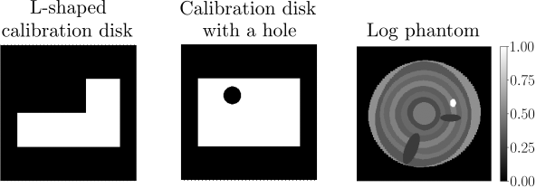

# Geometry Parameter Estimation for Sparse X-ray Log Imaging
## General information
The repository contains scripts for geometry parameter estimation 
and reconstruction in fan-beam X-ray tomography in application to sawmill log imaging:
* `geom_param_search.py` - script for obtaining optimal geometry parameters, 
where we calculate the maximum cross-correlation between a known-sized calibration object image 
and its filtered backprojection reconstruction, 
and use differential evolution as an optimiser;
* `plot_recos_with_params.py` - script to obtain filtered backprojection reconstructions of log phantom with different parametrisations
and plot them in one figure for comparison;
* `get_reconstructions.py` -  script to obtain reconstructions of digital log phantom by three different methods 
(filtered backprojection, Tikhonov regularisation and Bayesian inversion with edge-preserving Cauchy difference priors) 
for various number of projection angles;
* `theorymatrix.jl` - Julia script used in `get_reconstructions.py` to implement Bayesian inversion with edge-preserving Cauchy priors;

For geometry parameter search and reconstruction, we provide synthetic data: 

* images of two calibration phantoms used for geometry parameter estimation:
  - calibration phantom with a hole (```./hole_disk/```);
  - L-shaped calibration phantom (```./L_disk/```);
* image of log phantom (```log_phantom/phantom_true_256.mat```) 
and its synthetic full-angle X-ray measurements used for testing (```log_phantom/phantom_sinogram_noise_2.npy```). 

## Installation
The scripts use the Conda environment and the Operator Discretization Library (ODL).
You can use the installation guide from the ODL documentation:
https://odlgroup.github.io/odl/getting_started/installing_source.html

Alternatively, you can run the following command 

```shell
conda create --name odl-py3.6 --file freezed-requirements.txt
```

The command should create the Conda environment  with name `odl-py3.6` and install all the required  dependencies.

To activate the Conda environment, you should run 

```shell
conda activate odl-py3.6
```

## Geometry parameter estimation with calibration phantoms 

### Run one parameter search program 

To estimate geometry parameters, you should run the following command 

```shell
python3 geom_param_search.py -d <calibration_phantom_name> -p <number_of_projections> -r <number_of_runs> 
```

Option -d corresponds to the calibration disk ("L-disk" or "hole-disk"), -p corresponds to the number of projection 
angles (CT measurements of the calibration disk) used in the geometry parameter search, 
-r corresponds to the number of program calls
(meaning the number of different optimal parameter vectors that will be obtained as a result of the optimisation procedure)

For example, to perform parameter search 5 times based on full-angle (360 projection angles) CT measurements of
L-shaped calibration disk, you should run  

```shell
python3 geom_param_search.py -d L-disk -p 360 -r 5 
```

As a result, the array of 5 optimal parameter vectors (+ values of the cost function J(theta))
will be saved as a numpy file to directory `./<calibration_phantom_name>/params/`.

If you need only one optimal parameter vector you can simply omit the -r option, i.e. 

```shell
python3 geom_param_search.py -d <calibration_phantom_name> -p <number_of_projections> 
```

### Plot reconstructions with different parametrisations
After running parameter search with at least 5 program calls (specify 5 after -r option in the command above)
and obtaining 5 different optimal parametrisation (geometry parameter vectors),
you can plot filtered backprojection reconstructions with those different parametrisations in one figure for comparison.
You should run the following command with options -d and -p that were specified above

```shell
python3 plot_recos_with_params.py -d <calibration_phantom_name> -p <number_of_projections>
```
The resulting Figure will be saved as "./<calibration_phantom_name>/recos_with_params.png"

## Reconstruction using different methods and various number of projection angles

To obtain reconstructions using three different methods 
(filtered backprojection, Tikhonov regularisation, 
and Bayesian inversion with first-order Cauchy difference priors) 
for various number of projection angles (360, 180, 90, 45, 20), 
you should run 

```shell
python3 get_reconstructions.py -d <calibration_phantom_name> -p <number_of_projections>
```

Using options -d and -p, you can choose the calibration disc and number of projection angles that were used 
in the geometry parameter search (to load the corresponding file). However, you should first run geometry parameter search 
to generate the file containing different parametrisations as described above.

Note: Since the script `get_reconstructions.py` invokes the Julia script `theorymatrix.jl`,
you should get Julia installed first. Next, you should install the required Julia packages 

```
"ArgParse"
"MAT" 
"Optim"
"ProgressBars"
"RegionTrees" 
"StaticArrays"
"VectorizedRoutines" 
```
by running 

```shell
julia
using Pkg
Pkg.install("<package_name>")
```

When all the packages are installed, run ```exit()``` to quit the virtual session.

